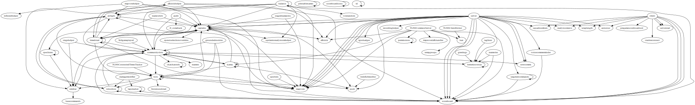

Lua Plugin Dependency list:
---------------------------

Here is a list of Lua Plugin dependencies of the codebase as a starting point to understanding the code a bit better. There may be errors in this list due to the simplistic way it was generated. Refinement can be done if examples of errors are found. 

Contact [OrigamiPaper](https://github.com/OrigamiPaper) if you find any missing dependencies so he can fix the list and the way the are parsed. In general, OrigamiPaper doesn't know too much about ns2 modding or Lua so he might need a little help understanding how everything ties together.

Modules, in the true lua sense, are not used very much. Thus, tools like [depgraph](https://github.com/mpeterv/depgraph) is don't give a good picture of the codebase. That is simply the way either ns2 or shine is designed it seems.

Important note: The plugin name is what [Wyzcrak](https://github.com/lancehilliard) calls the module in his code but they do not always correspond to a lua script. This is evident on the graph I hacked together from that is based on the table.

|Filename|Plugin|
|---------------------------------------------------|-------------------------|
| shine/extensions/afkkickhelper.lua                | afkkick                 |
| shine/extensions/afkkickhelper.lua                | arclight                |
| shine/extensions/afkkickhelper.lua                | captains                |
| shine/extensions/afkkickhelper.lua                | scoreboard              |
| shine/extensions/afkkickhelper.lua                | timedstart              |
| shine/extensions/arclight/arclight.lua            | arclight                |
| shine/extensions/arclight/arclight.lua            | bots                    |
| shine/extensions/arclight/arclight.lua            | captains                |
| shine/extensions/arclight/arclight.lua            | communityslots          |
| shine/extensions/arclight/arclight.lua            | mapvote                 |
| shine/extensions/arclight/arclight.lua            | winorlose               |
| shine/extensions/audit.lua                        | captains                |
| shine/extensions/audit.lua                        | communityslots          |
| shine/extensions/audit.lua                        | tf_comeback             |
| shine/extensions/autoexec/client.lua              | autoexec                |
| shine/extensions/autoexec/server.lua              | autoexec                |
| shine/extensions/balance/balance.lua              | arclight                |
| shine/extensions/balance/balance.lua              | balance                 |
| shine/extensions/balance/balance.lua              | captains                |
| shine/extensions/balance/balance.lua              | communityslots          |
| shine/extensions/balance/balance.lua              | mapvote                 |
| shine/extensions/balance/balance.lua              | scoreboard              |
| shine/extensions/balance/balance.lua              | sidebar                 |
| shine/extensions/balance/balance.lua              | updatetoreadyroomhelper |
| shine/extensions/balance/balance.lua              | voterandom              |
| shine/extensions/betterknownas.lua                | betterknownas           |
| shine/extensions/bots.lua                         | bots                    |
| shine/extensions/bots.lua                         | captains                |
| shine/extensions/bots.lua                         | forceroundstart         |
| shine/extensions/bots.lua                         | mapvote                 |
| shine/extensions/bots.lua                         | push                    |
| shine/extensions/bots.lua                         | sidebar                 |
| shine/extensions/bots.lua                         | winorlose               |
| shine/extensions/captains/captains.lua            | afkkick                 |
| shine/extensions/captains/captains.lua            | captains                |
| shine/extensions/captains/captains.lua            | mapvote                 |
| shine/extensions/captains/captains.lua            | push                    |
| shine/extensions/captains/captains.lua            | scoreboard              |
| shine/extensions/captains/captains.lua            | sidebar                 |
| shine/extensions/captains/captains.lua            | spawnselectionoverrides |
| shine/extensions/captains/captains.lua            | timedstart              |
| shine/extensions/captains/captains.lua            | updatetoreadyroomhelper |
| shine/extensions/chatchannels.lua                 | chatchannels            |
| shine/extensions/communityslots.lua               | betterknownas           |
| shine/extensions/communityslots.lua               | bots                    |
| shine/extensions/communityslots.lua               | captains                |
| shine/extensions/communityslots.lua               | chatchannels            |
| shine/extensions/communityslots.lua               | communityslots          |
| shine/extensions/communityslots.lua               | karma                   |
| shine/extensions/communityslots.lua               | newcomms                |
| shine/extensions/communityslots.lua               | scoreboard              |
| shine/extensions/communityslots.lua               | sidebar                 |
| shine/extensions/communityslots.lua               | teamres                 |
| shine/extensions/crashreconnect/client.lua        | serverstart             |
| shine/extensions/damagemodifier.lua               | lapstracker             |
| shine/extensions/damagemodifier.lua               | winorlose               |
| shine/extensions/fullgameplayed.lua               | communityslots          |
| shine/extensions/gorgetunnelhelper/client.lua     | scoreboard              |
| shine/extensions/greetings.lua                    | betterknownas           |
| shine/extensions/groundedrookies.lua              | bots                    |
| shine/extensions/groundedrookies.lua              | communityslots          |
| shine/extensions/groundedrookies.lua              | scoreboard              |
| shine/extensions/hidefullmodlist.lua              | push                    |
| shine/extensions/infestedhelper/server.lua        | mapvote                 |
| shine/extensions/karma.lua                        | bots                    |
| shine/extensions/karma.lua                        | captains                |
| shine/extensions/karma.lua                        | communityslots          |
| shine/extensions/karma.lua                        | karma                   |
| shine/extensions/karma.lua                        | push                    |
| shine/extensions/lapstracker.lua                  | lapstracker             |
| shine/extensions/lapstracker.lua                  | scoreboard              |
| shine/extensions/mapvotehelper.lua                | arclight                |
| shine/extensions/mapvotehelper.lua                | captains                |
| shine/extensions/mapvotehelper.lua                | infestedhelper          |
| shine/extensions/mapvotehelper.lua                | mapvote                 |
| shine/extensions/newcomms/server.lua              | newcomms                |
| shine/extensions/newcomms/server.lua              | scoreboard              |
| shine/extensions/permissions.lua                  | permissions             |
| shine/extensions/pregamescoreboardsort/client.lua | pregamescoreboardsort   |
| shine/extensions/printablenames.lua               | printablenames          |
| shine/extensions/recordinghelper/client.lua       | scoreboard              |
| shine/extensions/recordinghelper/server.lua       | recordinghelper         |
| shine/extensions/restartwhenempty/server.lua      | mapvote                 |
| shine/extensions/scoreboard/client.lua            | scoreboard              |
| shine/extensions/scoreboard/client.lua            | squadnumbers            |
| shine/extensions/scoreboardicons.lua              | scoreboardicons         |
| shine/extensions/scoreboard/server.lua            | afkkick                 |
| shine/extensions/scoreboard/server.lua            | betterknownas           |
| shine/extensions/scoreboard/server.lua            | captains                |
| shine/extensions/scoreboard/server.lua            | newcomms                |
| shine/extensions/scoreboard/server.lua            | scoreboard              |
| shine/extensions/scoreboard/server.lua            | speclisten              |
| shine/extensions/scoreboard/server.lua            | squadnumbers            |
| shine/extensions/scoreboard/server.lua            | targetedcommands        |
| shine/extensions/scoreboard/server.lua            | voicecommreminder       |
| shine/extensions/serverstart/client.lua           | crashreconnect          |
| shine/extensions/serverstart/client.lua           | serverstart             |
| shine/extensions/serverstart/server.lua           | mapvote                 |
| shine/extensions/serverstart/server.lua           | push                    |
| shine/extensions/sidebar.lua                      | basecommands            |
| shine/extensions/siegehelper.lua                  | communityslots          |
| shine/extensions/siegehelper.lua                  | sidebar                 |
| shine/extensions/specbets.lua                     | mapvote                 |
| shine/extensions/speclisten.lua                   | sidebar                 |
| shine/extensions/speclisten.lua                   | speclisten              |
| shine/extensions/sprayhelper/client.lua           | readyroomrave           |
| shine/extensions/sprayhelper/server.lua           | readyroomrave           |
| shine/extensions/squadnumbers/server.lua          | captains                |
| shine/extensions/squadnumbers/server.lua          | scoreboard              |
| shine/extensions/stagedteamjoins.lua              | captains                |
| shine/extensions/stagedteamjoins.lua              | mapvote                 |
| shine/extensions/taglines.lua                     | betterknownas           |
| shine/extensions/targetedcommands.lua             | scoreboard              |
| shine/extensions/targetedcommands.lua             | targetedcommands        |
| shine/extensions/td/td.lua                        | td                      |
| shine/extensions/teamroles.lua                    | betterknownas           |
| shine/extensions/teamroles.lua                    | scoreboard              |
| shine/extensions/teamswitch.lua                   | captains                |
| shine/extensions/teamswitch.lua                   | timedstart              |
| shine/extensions/tgnsbadges/server.lua            | mapvote                 |
| shine/extensions/tgnsbadges/server.lua            | tgnsbadges              |
| shine/extensions/timedstart.lua                   | afkkickhelper           |
| shine/extensions/timedstart.lua                   | arclight                |
| shine/extensions/timedstart.lua                   | bots                    |
| shine/extensions/timedstart.lua                   | captains                |
| shine/extensions/timedstart.lua                   | communityslots          |
| shine/extensions/timedstart.lua                   | mapvote                 |
| shine/extensions/timedstart.lua                   | timedstart              |
| shine/extensions/voicecommreminder.lua            | scoreboard              |
| shine/extensions/winorlose.lua                    | arclight                |
| shine/extensions/winorlose.lua                    | communityslots          |
| shine/extensions/winorlose.lua                    | scoreboard              |
| shine/extensions/winorlose.lua                    | winorlose               |
| shine/extensions/wraplength/client.lua            | wraplength              |
| shine/extensions/wraplength/server.lua            | wraplength              |
| tgns/server/TGNSClientKicker.lua                  | ban                     |
| tgns/server/TGNSCommonServer.lua                  | afkkick                 |
| tgns/server/TGNSCommonServer.lua                  | ban                     |
| tgns/server/TGNSCommonServer.lua                  | improvedafkhandler      |
| tgns/server/TGNSCommonServer.lua                  | karma                   |
| tgns/server/TGNSCommonServer.lua                  | mapvote                 |
| tgns/server/TGNSCommonServer.lua                  | permissions             |
| tgns/server/TGNSCommonServer.lua                  | scoreboard              |
| tgns/server/TGNSCommonServer.lua                  | tempgroups              |
| tgns/server/TGNSConnectedTimesTracker.lua         | bots                    |

### Plugin Dependency Graph:


A plugin dependency graph based on the lua file names and referenced Shine.Plugin objects

### How files were (crudely) generated:
Note these dependencies are generate from parsing the file looking for "Shine.Plugins" string in each file and will produce false positives when commentted code is found. Linux command line below:

```{bash}
cd docs
find ../* | grep "\.lua" > all_lua.txt
cat all_lua.txt | xargs grep -oP "Shine.Plugins\.([^\s.:[]+)" | sort -u > PluginsAssociationRaw.txt
```
